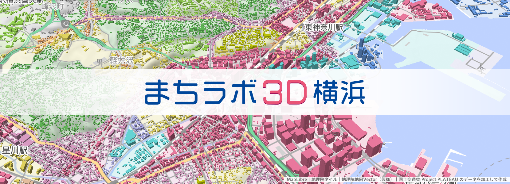

# まちラボ3D横浜

* Webサイトは[**こちら**](https://sk0540.github.io/machi-labo-3D-yokohama/) 

---

## 「まちラボ3D横浜」とは
「まちラボ3D横浜」は、神奈川県横浜市内の都市計画を視覚的に学ぶための3Dのマップです。
ここでは「用途地域」を3Dビューで調べられるマップを提供しています。

## 使用技術

### Vue3 (TypeScript)
UIフレームワーク
ポップアップ／検索／ガイドUIなど

### MapLibre
地図描画ライブラリMapboxのオープンソース版（[公式サイト](https://maplibre.org/)）

ベース地図表示／3D建物データ読み込みなど

## 使用データ

### ベース地図
国土地理院が配信している[地理院地図](https://maps.gsi.go.jp/help/index.html)を使用

* 地図データ……地理院地図ベクトルタイル - 地理院地図Vector提供実験（[GitHub](https://github.com/gsi-cyberjapan/gsimaps-vector-experiment)）
* 標高データ……地理院標高タイル
ライブラリ読込 `maplibre-gl-gsi-terrain`（[GitHub](https://github.com/mug-jp/maplibre-gl-gsi-terrainを使用)）

### 建物と用途地域データ

国土交通省が公開している都市の3Dモデル[Project PLATEAU](https://www.mlit.go.jp/plateau/)のデータを利用

[横浜市 2023年](https://www.geospatial.jp/ckan/dataset/plateau-14100-yokohama-shi-2023)のデータを（G空間情報センターから利用可能）
* 建築モデル……外形のポリゴンと建物高さのデータを使用
* 都市計画決定情報モデル……都市計画区域データ／用途地域データを使用

## データの加工
MapLibreで読み込めるように各建物と用途地域とを結合したデータを加工して用意
### 空間結合
pythonでGeoJSONデータに変換 -> 
pythonの`geopandas`ライブラリで結合データを作成（`sjoin`関数を使用）

### タイルデータで配信

タイルを1つのファイルで配信できるデータ形式の[PMTiles](https://github.com/protomaps/PMTiles)を使用  
tippecanoeを使い変換でGeoJSONからPMTilesを作成 ->  GitHub Pagesに配置しMapLibreで読込

## 検索機能
キーワードの地名を入力して横浜市内の地名に絞込した検索結果からその地点に移動できます。

地理院地図の地名検索API
`https://msearch.gsi.go.jp/address-search/AddressSearch`  
を利用しキーワードから地名などの緯度経度を取得しています。
